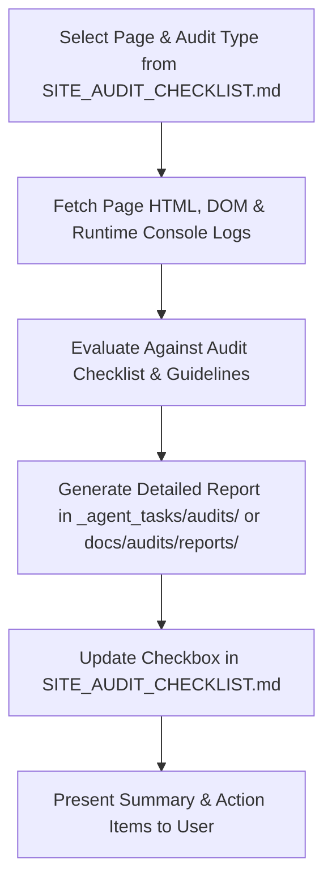

# Indigenous Tourism Manitoba — Site Audit Framework

This framework defines the methodology, standards, and workflow for conducting systematic, single-page / single-concern audits across the **66 active pages** of `https://indigenoustourismmanitoba.ca/`.

---

## 1. The Four Audit Pillars

Each page on the site is audited across four distinct criteria:

| Audit Style | Primary Focus | Reference Standard | Key Artifact / Guide |
|---|---|---|---|
| ♿ **Accessibility** | Identifies discoverable accessibility barriers (contrast, alt text, headings, keyboard focus, labels, forms). | WCAG 2.1 AA | [`ACCESSIBILITY_AUDIT_GUIDE.md`](./ACCESSIBILITY_AUDIT_GUIDE.md) |
| ✍️ **Content** | Catches spelling/grammar errors, empty/broken hero banners, broken links (404s), placeholders, and editorial tone. | Editorial Integrity | [`CONTENT_AUDIT_GUIDE.md`](./CONTENT_AUDIT_GUIDE.md) |
| 🎯 **Marketing** | Uncovers conversion opportunities, evaluates CTA hierarchy, removes user friction, and clarifies page functionality. | Conversion & UX | [`MARKETING_AUDIT_GUIDE.md`](./MARKETING_AUDIT_GUIDE.md) |
| ⚡ **Performance** | Detects console runtime errors, broken asset requests, layout shifts, unoptimized media, and script bottlenecks without external tools. | Runtime & DOM Health | [`PERFORMANCE_AUDIT_GUIDE.md`](./PERFORMANCE_AUDIT_GUIDE.md) |

---

## 2. Standardized Audit Workflow for Agents

When an agent is assigned to audit a specific page for a specific concern:



### Step 1: Initialize Task
1. Check [`SITE_AUDIT_CHECKLIST.md`](../../SITE_AUDIT_CHECKLIST.md) to confirm the target page URL and audit type.
2. Review the corresponding Skill file (`.agents/skills/audit-<type>/SKILL.md`) or Guide (`docs/audits/<TYPE>_AUDIT_GUIDE.md`).

### Step 2: Inspection & Verification
- Inspect the live page DOM, HTML source code, images, links, styles, and console logs.
- Test interactive elements (buttons, links, forms, accordions, tabs).

### Step 3: Produce Standardized Report
- Write the report using [`REPORT_TEMPLATE.md`](./REPORT_TEMPLATE.md).
- Save report to: `docs/audits/reports/<page-slug>_<audit-type>.md` (e.g. `docs/audits/reports/home_accessibility.md`).

### Step 4: Update Progress
- Check off the corresponding subitem in [`SITE_AUDIT_CHECKLIST.md`](../../SITE_AUDIT_CHECKLIST.md):
  ```markdown
  - [ ] [Home](https://indigenoustourismmanitoba.ca/)
    - [x] accessibility
    - [ ] content
    - [ ] marketing
    - [ ] performance
  ```
- When all 4 subitems are complete for a page, check off the parent page checkbox.

---

## 3. Directory Structure

```
├── SITE_AUDIT_CHECKLIST.md           # Master tracking checklist (66 pages)
├── .agents/skills/
│   ├── audit-accessibility/SKILL.md  # Accessibility audit skill definition
│   ├── audit-content/SKILL.md        # Content audit skill definition
│   ├── audit-marketing/SKILL.md      # Marketing audit skill definition
│   └── audit-performance/SKILL.md    # Performance audit skill definition
└── docs/audits/
    ├── AUDIT_FRAMEWORK.md            # This framework overview
    ├── ACCESSIBILITY_AUDIT_GUIDE.md  # In-depth WCAG 2.1 AA reference guide
    ├── CONTENT_AUDIT_GUIDE.md        # Editorial, media & link verification guide
    ├── MARKETING_AUDIT_GUIDE.md      # Conversion, CTA & UX guide
    ├── PERFORMANCE_AUDIT_GUIDE.md    # Runtime, console & asset performance guide
    ├── REPORT_TEMPLATE.md            # Standardized markdown report template
    └── reports/                      # Directory where individual audit reports are saved
```
